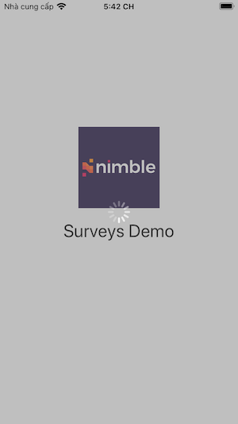
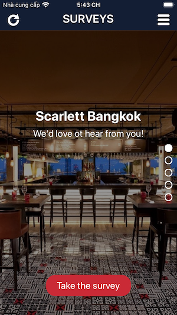

# Surveys Demo App

An application that allows users to browse a list of surveys. For the UI:

             Loading Screen           ->          Surveys Screen           ->           Survey Detail 

       


##  Demo
### 1. GIF
#### Real Data


#### Dummy data

 

### 2. Youtube
Link: https://youtu.be/T1JwIzzWBqA

##  Requirements
- iOS 10.0+
- Xcode 10+
### Installations
Remember to run ``` pod install ``` before running the project.

##  Main Files
###  Control Files
- LoadingViewController.swift: get access token and surveys data.
- SurveysViewController.swift: allows users to browse a list of surveys, reload surveys data and direct user to see the survey details.
- SurveyDetailViewController.swift: display selected survey detail informations.
- Main.storyboard: includes all the UI of the 3 screens.
- APIServices.swift: using Alamorfire to communicate with Nimble server to get data. All API's requests should come from here.

### Custom View Files
- VerticalPageControlView.swift: a custom of UIScrollView to emulate a vertical page control.
- VerticalPageControlViewModel.swift: is the model of VerticalPageControlView, which contains logics, validations, model properties/functions of the Vertical Page Control.
- VPCHelpers.swift: contains VPCButtonHelper and VPCPageHelper to help haandling logic for Vertical Page Control.
- VPCValidations.swift: contains VPCValidationService and VPCValidationError to help about validations for Vertical Page Control.


## That's it! Thank you and have a nice day!
