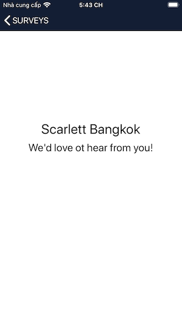

# Surveys Demo App
> This demo application aims to participate in the challenge of Nimble company.


An application that allows users to browse a list of surveys. For the UI:

             Loading Screen           ->          Surveys Screen           ->           Survey Detail 

       


##  Demo
### 1. GIF
#### Real Data


#### Dummy data

 

### 2. Youtube
Link: https://youtu.be/T1JwIzzWBqA

##  Requirements
- iOS 10.0+
- Xcode 10+
### Installations
Remember to run ``` pod install ``` before running the project.

##  Main Files

- VerticalPageContorlView.swift: a custom of UIScrollView to emulate a vertical page control
- LoadingViewController.swift: get token and surveys data.
- SurveysViewController.swift: allows users to browse a list of surveys, reload surveys data and redirect to see more survey detail.
- SurveyDetailViewController.swift: display detail's of the selected survey
- Main.storyboard: includes all the UI of the 3 screens.
- APIServices.swift: using Alamorfire to communicate with Nimble server to get data. All APIs request should come from here.

## That's it! Have a nice day!
